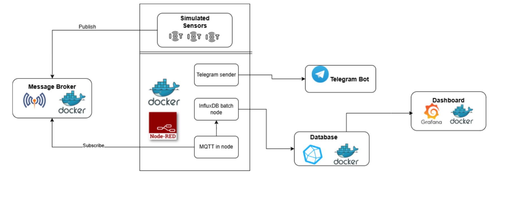

## Crop monitoring IOT Project
Components Overview:
1. Sensor Nodes: Simulated using Node-RED inject nodes.
2. Communication Layer: MQTT broker for real-time data transfer.
3. Processing Layer: Node-RED for data filtering and processing.
4. Storage Layer: InfluxDB for efficient time-series storage.
5. Visualization Layer: Grafana for monitoring dashboards.
6. Alert System: Telegram bot for notification delivery.

